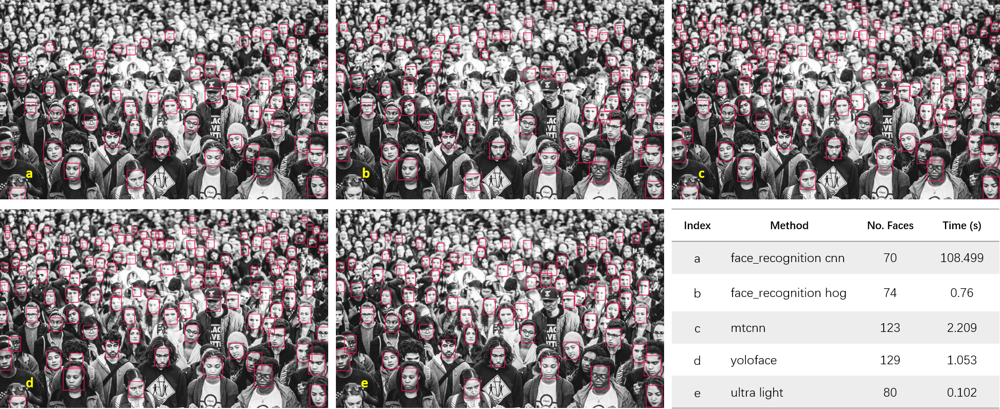
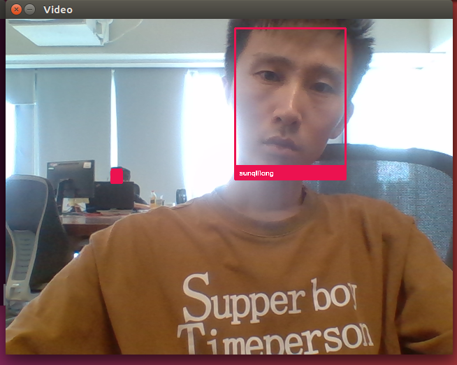

# Face Detection Demo
基于onnx runtime进行人脸检测和人脸识别


## 人脸检测
```
urltra_light.py   
```
使用 ultra-light model 进行人脸探测，模型只有1M大小。 
相比于MTCNN等，尽管检测精度下降了一些，但是运行速度提高了好几倍。
效果对比如下


## 人脸识别
```
facenet.py
```
先注释prepare_features() 进行人脸特征数据准备，可以在文件下添加自己的人脸视频  
demo_video() 进行人脸识别


## facenet LFW准确率验证
```
LFW_test.py
```
准确率测试结果  
max accuary: 0.990
threshold: 1.19

 
## 引用
[facenet](https://github.com/davidsandberg/facenet.git)
[urltra_light](https://towardsdatascience.com/real-time-face-recognition-with-cpu-983d35cc3ec5 )


 
